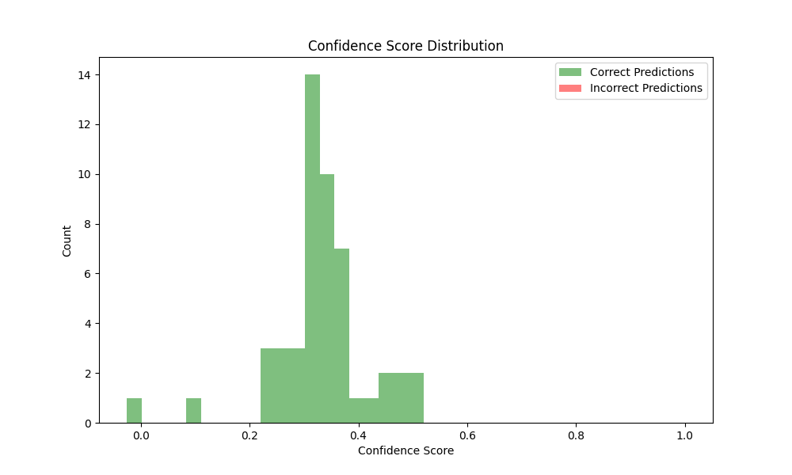
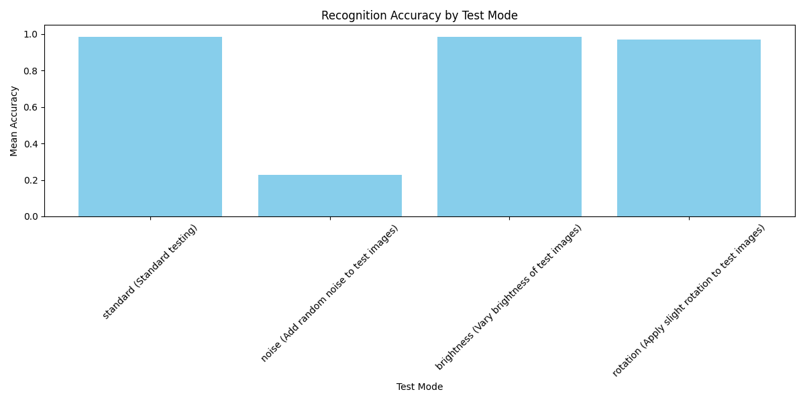

# FaceFlask — Face Recognition Attendance System

<p align="center">
  
  
  
  
  
</p>

<p align="center">
  A real-time attendance system that recognizes registered students from a live webcam feed and logs attendance automatically, with liveness checks to prevent photo/video spoofing.
</p>

<p align="center">
  <strong>Built to replace a 20-minute manual attendance process for a class of 30+ students with a sub-second, camera-based check-in.</strong>
</p>

---

## Why This Exists

Manual attendance does not scale and is easy to game with a photo of someone''s face held up to a webcam. This project tackles both problems:

- **Speed** — recognition at classroom scale, no paper or roll calls
- **Security** — liveness verification so a static photo cannot be marked present

---

## How It Works

### Recognition Pipeline

Faces are detected per frame using a **Haar cascade classifier**, then matched against enrolled students using **OpenCV''s LBPH** (Local Binary Patterns Histograms) face recognizer.

A **confidence threshold** combined with a **temporal consistency check** (a face must be recognized across several consecutive frames, not just one) gates whether a match is accepted — cutting down on false positives from a single noisy frame.

### Liveness Detection (Anti-Spoofing)

A photo held up to the camera will match the LBPH model just as well as a real face, so recognition alone is not enough. Two independent signals are combined to confirm a live person:

| Signal | Method |
|--------|--------|
| **Blink Detection** | MediaPipe FaceMesh tracks eye landmarks and computes Eye Aspect Ratio (EAR) per frame. A genuine blink shows up as a characteristic dip-and-recover in EAR over consecutive frames. |
| **Motion Verification** | Farneback dense optical flow between consecutive frames measures natural micro-motion (head/body jitter) that a static printed photo will not produce — catching spoofing attempts that blink detection alone could miss (e.g. a video replay). |

Attendance is only logged once a face is **recognized AND liveness is confirmed**. Each entry records the confidence score plus which liveness signal(s) passed.

### Web App

A Flask app serves the live camera feed and provides:

- Student Registration — capture and enroll new faces
- Live Recognition View — attendance auto-logging with confidence overlay
- Attendance Reports — exportable as CSV or PDF
- Student Management — add/remove enrolled students, trigger retraining

---

## Model Evaluation

[`model_evaluation.py`](model_evaluation.py) runs **5-fold cross-validation** over 250 face images across 5 individuals, and stress-tests the recognizer under conditions it will actually see in a classroom — not just clean, ideal images.

| Test Condition | Accuracy | Precision | Recall | F1 |
|---|---|---|---|---|
| Standard | 98.4% | 98.6% | 98.4% | 98.4% |
| Brightness variation | 98.4% | 98.6% | 98.4% | 98.4% |
| Slight rotation | 97.2% | 97.4% | 97.2% | 97.2% |
| Random noise | 22.8% | 7.7% | 22.8% | 11.1% |

The noise result is the most useful finding — not a failure to hide. LBPH is clearly not robust to sensor/image noise, which is a real limitation for low-light or low-quality webcams. That gap is the main motivation for moving to a learned embedding-based recognizer (e.g. a small CNN or FaceNet-style model) as the next step.

Full report and plots are in [`evaluation_results/`](evaluation_results/).

<p align="center">
  
  
</p>
<p align="center">
  
</p>

---

## Tech Stack

| Layer | Libraries |
|---|---|
| **Backend** | Python, Flask |
| **Recognition** | OpenCV (Haar cascade + LBPH) |
| **Liveness** | MediaPipe (FaceMesh), Farneback optical flow |
| **Data** | NumPy, pandas |
| **Evaluation** | scikit-learn (cross-validation), Matplotlib, Seaborn |

---

## Project Structure

```
FaceFlask/
├── system/
│   ├── app.py              # Flask app: recognition, liveness, routes
│   ├── students.json       # Enrolled student records
│   ├── attendance.csv      # Attendance log
│   ├── static/             # CSS
│   └── templates/          # HTML templates
│       ├── index.html
│       ├── register.html
│       ├── manage.html
│       ├── report.html
│       └── welcome.html
├── model_evaluation.py     # Cross-validation + robustness evaluation
├── evaluation_results/     # Evaluation report, confusion matrix, plots
└── requirements.txt
```

---

## Running Locally

```bash
git clone https://github.com/ravindudilshaan01/FaceFlask.git
cd FaceFlask
pip install -r requirements.txt
cd system
python app.py
```

Then open **http://localhost:5000**, register a student (a few captures per person for enrollment), and switch to the live recognition view to start logging attendance.

> **Note:** A working webcam is required. Make sure to allow browser/OS camera permissions.

---

## Limitations & Next Steps

- **Noise robustness** — LBPH accuracy collapses under image noise (see evaluation table); a learned embedding model would be far more robust
- **Single face per frame** — extending to multi-face detection would speed up group check-ins
- **No containerization yet** — planned: Dockerize the Flask app for easier setup and deployment

---

## License

This project is open source under the [MIT License](LICENSE).
